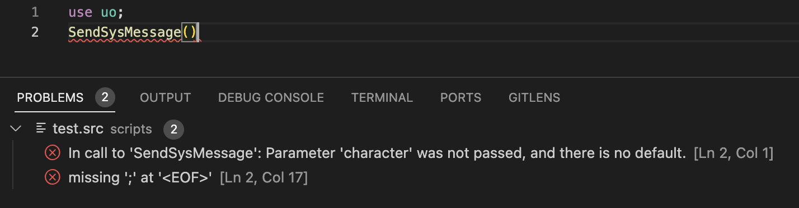

# vscode-escript

`vscode-escript` helps developers write, understand and improve Escript code for
POL shards by providing:

 - code completion
 - compile errors and warnings
 - signature help
 - go to definition
 - hover information
 - references
 - debugger

## Setup

This extension requires no additional software, as POL's Escript analytics are
included in the extension.

### Project setup

After installing the extension, open a POL distribution via "Open Folder".
Ensure that the folder selected contains `pol.cfg` and `scripts/ecompile.cfg`
files.

### Extension Configuration

The extension contains various options that alter the behavior of its analytics,
documentation features, and other behaviors. Search for "Escript" inside the
VSCode Preferences panel to find the current configuration options.

## Language Features

### Code completion

Suggestions will appear as you type names. Because vscode-escript uses POL's
Escript parser parser, code completion has access to precise information of
symbols, such as variables, module functions, and user functions.


### Compiler errors and warnings

Code errors are shown as you type (both as red squiggle underlines, and in the
"Problems" panel). These are the same as produced by the Escript compiler.



### Go to Definition

The extension provides support for "go to definition" for various symbols
(variables, constants, user and module functions) as well as jumping to the
definition of a module (specified in a `use` declaration) and include file
(specified in an `include` declaration).


### Signature help

When typing `(` or `,`, the extension will show documentation for functions, as
well as the active parameter.


### Hover information

escript-vscode can describe almost any entity if you hover the mouse (or press
Ctrl-KI).


### References

The extension can find references to symbols, such as variables (both locally-
and globally-scoped), constants, user functions, and module functions across the
entire workspace.


### Debugger

POL 100.2.0 includes a Debug Adapter Protocol (DAP) server which the
vscode-escript extension can connect to for interactive debugging. New scripts
can be launched, and already-running scripts can be attached to. The debugger
supports the following features:

- execution flow (pause, continue, step in/out/over)
- breakpoints
- evaluating identifiers and simple expressions (eg. member access `who.name`)
  via Debug Console and Watch pane
- showing in-scope variables, setting variables in Variables pane
- changing current scope by using the Call Stack pane


#### Launch Script

Example launch configuration to run the current script in the Visual Studio Code
editor:

```json
{
  "type": "pol",
    "request": "launch",
    "name": "Launch current script",
    "port": 5002,
    "script": "${relativeFile}",
    "stopAtEntry": true
}
```

#### Attach to Script

Example launch configuration to attach to the current script in the Visual Studio Code
editor, displaying a PID selection of multiple scripts found:

```json
{
    "type": "pol",
    "request": "attach",
    "name": "Attach to script",
    "port": 5002,

    "pid": 0,
    // if "pid" not provided, must provide "script":
    "script": "${relativeFile}"
}
```

### Tips and Tricks

- To constantly refresh a compiled program from disk, add this to the top of
  your source file:

  ```
  use polsys;
  Unload_Scripts(GetProcess().name);
  ```

- To launch interactive scripts (eg. item use scripts), provide values for
  parameters that are not passed, eg.:

  ```
  program use_script(who, item)
    if (!who) who := SystemFindObjectBySerial(123, SYSFIND_SEARCH_OFFLINE_MOBILES); endif
    if (!item) item := SystemFindObjectBySerial(789); endif

    // ... rest of use script ...
  endprogram
  ```

### Notes

- Currently, the debugger cannot determine that a source file does not match the
  current compiled file. Please ensure your source scripts and compiled programs
  are in-sync.
- Attaching to a script currently sleeping (eg. `Sleep()`, `Wait_For_Event()`)
  will not wake the script. The function call must complete in order for the
  debugger to break.

## Troubleshooting/bugs

The extension uses a built-in version of the Escript compiler, and may crash
when processing invalid sources (eg. when actively typing). Disabling the
extension option `escript.continueAnalysisOnError` can assist with crashes on
erroneous sources at the expense of some functionality, as the extension will
not process an invalid source.

If the EScript Language Server crashes, it can be restarted by reloading the
window (Command Palette > Developer: Reload Window).

If you have excessively high memory usage (>400MB), this may be caused by the
use of the Workspace Cache for finding references across the entire workspace.
This feature can be disabled via setting the extension option
`escript.disableWorkspaceReferences` to `true`.

If you've found a bug in this extension, please file it at
https://github.com/polserver/vscode-escript/issues.

## Running the Extension via Debugging

- Run `npm install && npm build` in this folder. This installs all necessary
  node modules in both the client and server folder
- Open VS Code on this folder.
- Press Ctrl+Shift+B to compile the client.
- Switch to the Debug viewlet.
- Select `Launch Client` from the drop down.
- Run the launch config.
- In the new Visual Studio Code [Extension Development Host], open a POL distro
  folder that contains `pol.cfg` and `scripts/ecompile.cfg`.
- Check the "ECompile Language Server" channel in the Output pane.
